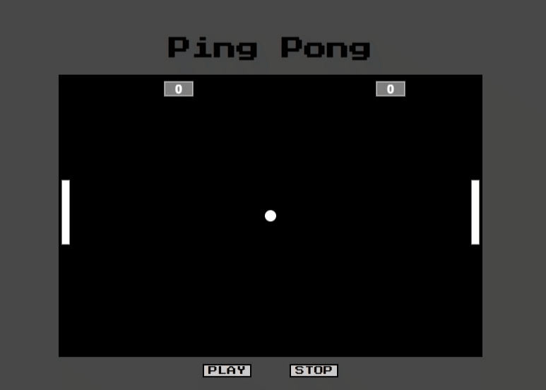

# ping-pong

## Processo de criação do projeto:

- [x] Criar estilo Css
- [x] Criar estrutura Html
- [x] Criar funcionalidades em JS e p5js

## Descrição

- Utilizando as setas, para cima e  para baixo mova a raquete e tente fazer pontos no oponente.

## Jogando ping Pong

Para jogar, acesse o link:

https://ping-pong-isagalvao.vercel.app/

## 🤝 Colaboradores

<table>
  <tr>
    <td align="center">
      <a href="#">
         
        
          <b>Isabelle Galvão</b>
        
      </a>
    </td>
  </tr>
</table>

